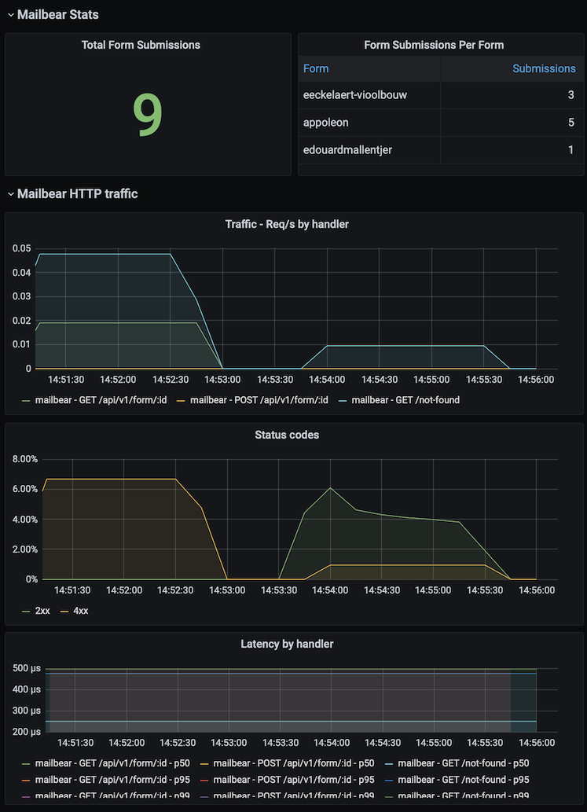

# 🐻 MailBear: Forms Backend

[](https://travis-ci.com/DenBeke/mailbear)
[](https://goreportcard.com/report/github.com/DenBeke/mailbear)
[](https://hub.docker.com/r/denbeke/mailbear)


MailBear is an open source, self hosted forms backend.
Just do a post request to the API with some form data, and MailBear will make sure the submission is sent to you via mail!

MailBear will always hide the email address of the recepient, since the forms are accessed by a unique key.


## Run with Docker

You can easily run MailBear with Docker:

Copy `config_sample.yml` to `config.yml` and run the server:

    docker run -v $(PWD)/config.yml:/mailbear/config.yml denbeke/mailbear

For your convenience I created a [docker-compose.yml](./docker-compose.yml) file.


## Run in Development

Copy `config_sample.yml` to `config.yml` and run the server:

    go run cmd/mailbear/main.go


## Configuration

Configuration is very simple. Just create as many forms as you want in `config.yml`:

```yaml
global:
    smtp:
        host: smtp.example.com
        port: 25
        user:
        password:
        disable_tls: true
        from_email: no-reply@example.com
        from_name: MailBear
    http:
        address: ":1234"


forms:
    some-form-name:
        key: some-random-key
        allowed_domains:
            - localhost:8080
            - example.com
        to_email:
            - recepient@example.com
```


## Usage

Once MailBear is running you can send requests with form data in the JSON body:

```bash
curl \
    -X POST \
    http://localhost:1234/api/v1/form/some-random-key \
    -H 'Content-Type: application/json' \
    -H 'Origin: http://localhost:8080' \
    -d '{"name":"Joe","email":"joe@example.com", "subject": "Some subject", "content": "Maecenas faucibus mollis interdum. Sed posuere consectetur est at lobortis."}'
```


## Examples


### MailBear with VueJS

```html
<template>
    <div id="contact">
  
      <div class="form" >

  
          <form @submit.prevent="submit">
  
              <div class="form-overlay" v-if="loading">
                  <font-awesome-icon icon="circle-notch" spin />
              </div><!-- form-overlay -->
  
              <div>
                  <div class="status" v-if="status !== ''">
                      <span v-if="status === 'success'">Your email has successfully been sent.</span>
                      <span v-if="status === 'error'">Something went wrong while sending your email.</span>
                  </div>
              </div>
  
              <div>
                  <input type="text" name="name" v-model="form_data.name" placeholder="Name or Company" required />
              </div>
  
              <div>
                  <input type="email" name="email" v-model="form_data.email" placeholder="Email" required />
              </div>
  
              <div>
                  <input type="text" name="subject" v-model="form_data.subject" placeholder="Subject" required />
              </div>
  
  
              <div>
                  <textarea type="text" name="content" v-model="form_data.content" placeholder="Message" rows="6" required />
              </div>
  
  
              <div>
                  <button type="submit">Send</button>
              </div>
          
        </form>
  
      </div>
  
    </div><!-- contact -->
</template>
  
<script>

import config from '../config'


export default {
    name: 'Contact',
    components: {
    },
    data: function() {
        return {
            contact_text: "",
            form_data: {
                name: "",
                email: "",
                subject: "",
                content: ""
            },
            status: "",
            loading: false
        }
    },
    created() {
    },
    mounted() {
    },
    methods: {
        clearForm: function() {
            this.form_data.name    = "";
            this.form_data.email   = "";
            this.form_data.subject = "";
            this.form_data.content = "";
        },
        submit: function(e) {
            e.preventDefault();

            var self = this
            self.loading = true
            
            this.axios.post(config.MAILBEAR_URL + `/api/v1/form/10810dce-1074-4988-a8f5-4c538a749a95`, this.form_data)
            .then(response => {
                self.status = "success"
                self.clearForm()

                return response
            })
            .catch(error => {
                self.status = "error"
                console.log(error)
            })
            .then(function () {
                // always executed
                self.loading = false
            })
        }
    }
}
</script>

<style lang="scss">
/*
 * Style was left out of this example. 
 * Go find it in ./examples/vuejs_example.vue
 */
</style>
```


### MailBear with jQuery


```html
<form id="contact-form" class="pure-form">
            
    <div class="meta">
        <input type="text" name="name" placeholder="Naam">
        
        <input type="email" name="email" placeholder="Email">

        <input type="text" name="subject" placeholder="Subject">
    </div><!-- .meta -->
    
    
    <textarea name="content" placeholder="Your message" rows="7"></textarea>
    
    <button type="submit" class="">
        <i class="fa fa-send-o"></i> Send
    </button>

    
    <div class="overlay">
        <div> 
        </div>
    </div><!-- .overlay -->
    
    
</form>


<script>
    $( document ).ready(function() {    
        
        var $contactForm = $('#contact-form');
        $contactForm.submit(function(e) {
            e.preventDefault();
            $.ajax({
                url: 'https://mailbear.yourdomain.com/api/v1/form/10810dce-1074-4988-a8f5-4c538a749a95',
                method: 'POST',
                data: $(this).serialize(),
                dataType: 'json',
                beforeSend: function() {
                    $contactForm.find('.overlay div').html('<div class="alert alert--loading"><i class="fa fa-circle-o-notch fa-spin"></i> &nbsp; Sending message...</div>');
                    $contactForm.find('.overlay').fadeIn();
                },
                success: function(data) {
                    $contactForm.find('.alert--loading').hide();
                    $contactForm.find('.overlay div').html('<div class="alert alert--success"><i class="fa fa-check"></i> &nbsp; Your message was sent successfully!</div>');
                    $contactForm.find('.overlay').fadeIn();
                },
                error: function(err) {
                    $contactForm.find('.alert--loading').hide();
                    $contactForm.find('.overlay div').html('<div class="alert alert--error"><i class="fa fa-warning"></i> &nbsp; Ooops, something went wrong.</div>');
                    $contactForm.find('.overlay').fadeIn();
                }
            });
        });
        $contactForm.find('.overlay').click(function(e) {
            $(this).fadeOut(); 
        });                
    });
</script>
```


## Metrics

Prometheus metrics can be found on `:9090/metrics` by default. To get statistics of submissions per form use this metric: `mailbear_form_submissions_total{form="some-form-name"}`.

A Grafana dashboard for these metrics is available here: [./grafana/dashboard.json](grafana/dashboard.json)

[](grafana/dashboard.png)


## Acknowledgements

* [github.com/labstack/echo](https://github.com/labstack/echo)
* [github.com/sirupsen/logrus](https://github.com/sirupsen/logrus)
* [github.com/go-yaml/yaml](https://github.com/go-yaml/yaml)
* [github.com/go-mail/mail](https://github.com/go-mail/mail)
* [github.com/badoux/checkmail](https://github.com/badoux/checkmail)
* [github.com/globocom/echo-prometheus](https://github.com/globocom/echo-prometheus)
* [github.com/prometheus/client_golang](https://github.com/prometheus/client_golang)


## Author

[Mathias Beke](https://denbeke.be)